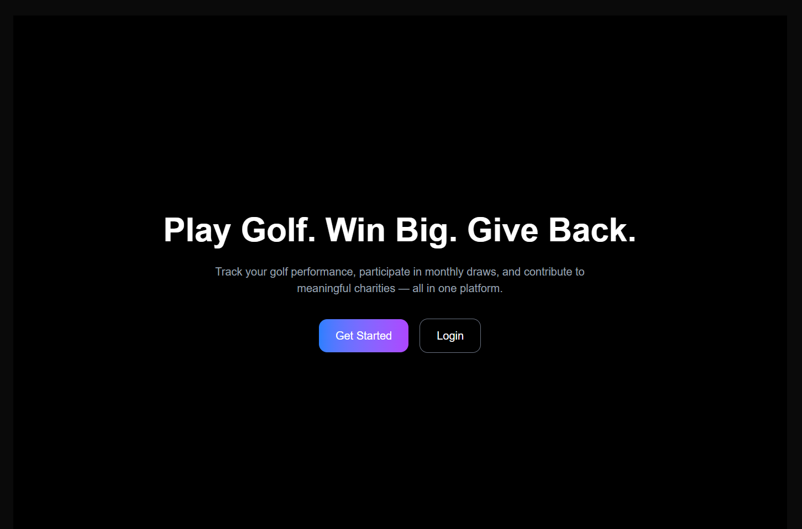
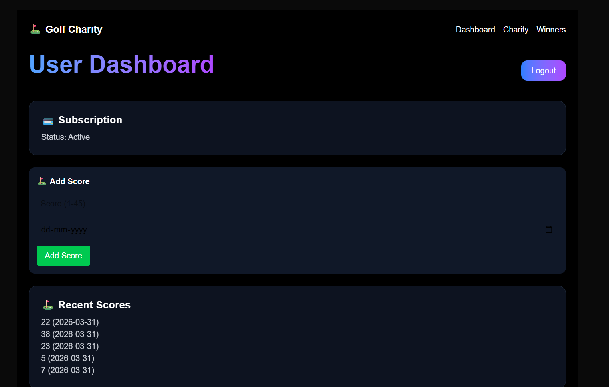
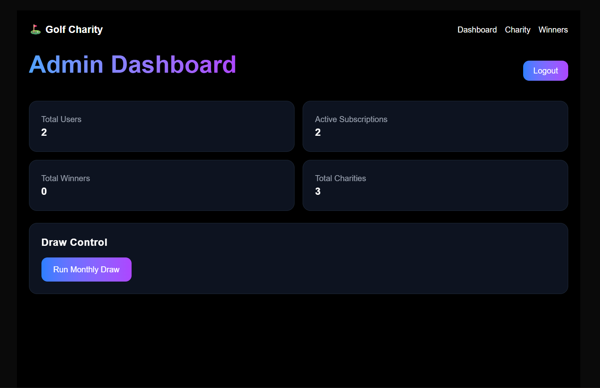
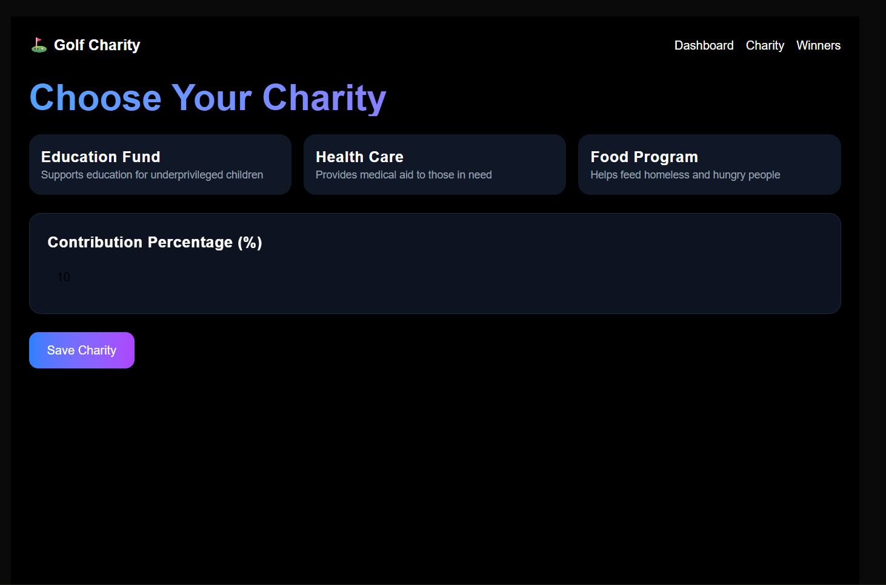
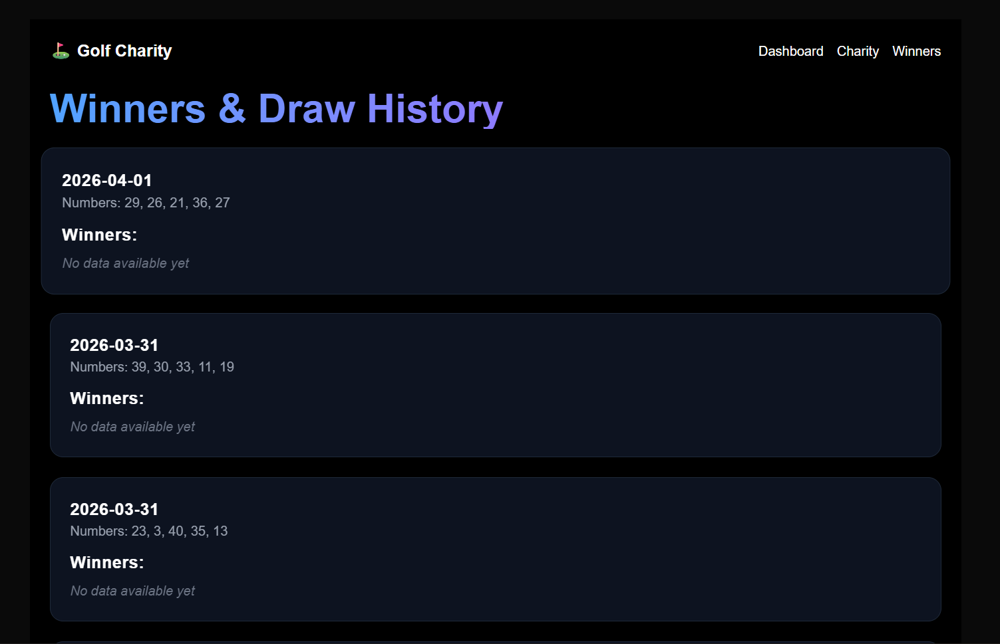

# Golf Charity Subscription Platform

A **production-grade full-stack web application** that blends **gamification, subscription economy, and social impact** into a single engaging platform.

Users track golf performance, participate in **monthly draw-based rewards**, and contribute to charities — creating a system where **every subscription drives both competition and impact**.

---

## Live Demo

Live URL: https://golf-charity-platform-snowy-six.vercel.app/

**User Login**
Email: [user@gmail.com](mailto:testuser@example.com)
Password: 424242

**Admin Login**
Email: [rachit@test.com](mailto:admin@example.com)
Password: 123456


---

## Test Payment  

Use Stripe test card:

Card Number: 4242 4242 4242 4242  
Expiry: Any future date  
CVV: Any 3 digits

> This project uses Stripe test mode — no real money is charged.
> Complete flow: Subscribe → Payment → Access unlocked → Participate in draws.

---

## Key Features

### User Experience

* Secure authentication using JWT
* Rolling **last-5 score tracking system** (Stableford format)
* Participation in automated monthly draw system
* Real-time winnings and participation tracking
* Subscription management (Monthly / Yearly)
* Charity selection with dynamic contribution percentage

---

### Admin Control Panel

* Full user and subscription management
* Draw execution with **simulation support**
* Automated winner calculation & validation
* Prize distribution + jackpot rollover logic
* Charity CRUD management
* Platform analytics dashboard

---

### Subscription & Payment System

* Integrated with **Stripe Checkout**
* Webhook-driven subscription lifecycle
* Real-time access control based on subscription status
* Handles renewal, expiry, and cancellation states

---

### Draw & Reward Engine

* Random number generation (1–45 range)

* Multi-tier matching system:

  * 5 Match → Tier 1 (Jackpot)
  * 4 Match → Tier 2
  * 3 Match → Tier 3

* Prize Pool Distribution:

  * 40% → Tier 1
  * 35% → Tier 2
  * 25% → Tier 3

* **Jackpot rollover system** for unclaimed Tier 1

---

### Charity Integration

* Users select a preferred charity at signup
* Minimum 10% contribution enforced
* Dynamic contribution adjustment supported
* Charity impact reflected in user dashboard

---

## System Design Highlights

### Rolling Score Logic

* Only latest 5 scores retained per user
* Automatic replacement of oldest score
* Reverse chronological display

### Prize Pool Calculation

* Real-time aggregation based on active subscriptions
* Tier-based distribution with equal split among winners
* Persistent rollover mechanism

### Security

* Row-Level Security (RLS) via **Supabase**
* JWT-based authentication
* Protected API routes with middleware

---

## Tech Stack

### Frontend

* **Next.js (App Router)**
* Tailwind CSS v4
* Framer Motion
* Axios

### Backend

* Node.js + Express
* Supabase (PostgreSQL + RLS)
* Stripe API

---

## Project Structure

```
golf-charity-platform/
│
├── backend/
│   ├── controllers/
│   ├── routes/
│   ├── middleware/
│   ├── config/
│   └── server.js
│
├── frontend/
│   ├── app/
│   ├── components/
│   ├── lib/
│   └── styles/
```

---

## Setup Instructions

### Clone Repository

```
git clone https://github.com/Rachit753/golf-charity-platform.git
cd golf-charity-platform
```

---

### Backend Setup

```
cd backend
npm install
```

Create `.env` file:

```
PORT=5000
SUPABASE_URL=your_url
SUPABASE_KEY=your_key
JWT_SECRET=your_secret
STRIPE_SECRET_KEY=your_stripe_key
STRIPE_WEBHOOK_SECRET=your_webhook_secret
```

Run server:

```
node server.js
```

---

### Frontend Setup

```
cd frontend
npm install
npm run dev
```

---

### Stripe Webhook (Local Testing)

```
stripe listen --forward-to localhost:5000/webhook
```

---

## Database Schema

Core tables:

* users
* subscriptions
* scores
* draws
* winners
* charities
* user_charity

---

## Screenshots

| Landing Page | Dashboard |
|-------------|----------|
|  |  |

| Admin Panel | Charity |
|------------|--------|
|  |  |

| Winners |
|--------|
|  |

---

## Key Engineering Highlights

* End-to-end **subscription + webhook system**
* Scalable backend architecture
* Real-time access control using subscription state
* Complex draw engine with prize distribution logic
* Secure database with RLS policies
* Clean, modern UI focused on engagement

---

## Future Enhancements

* Email notifications (draw results, payouts)
* WebSocket-based real-time updates
* Leaderboard system
* Mobile app version (architecture-ready)

---

## Contribution

Open to feedback and improvements. Feel free to fork and contribute!

---

## Contact

**Rachit**
GitHub: https://github.com/Rachit753
LinkedIn: https://www.linkedin.com/in/rachit-chauhan/

---

## Support

If you found this project interesting, consider giving it a ⭐ — it helps a lot!
